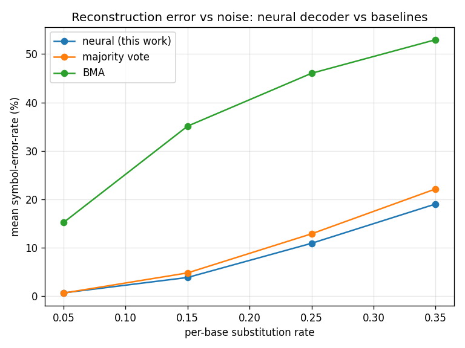

# neural-dna-decoder

**Neural consensus for noisy DNA sequencing reads: a Transformer that learns the underlying sequence structure to denoise multiple error-prone reads more accurately than classical majority voting — with the margin growing as the reads get noisier.**

[](https://github.com/REPLACE_ME/neural-dna-decoder/actions)


> Trains on **CPU in minutes** — no GPU required. All data is synthetic, so there is nothing to download.

---

## The idea

When DNA is sequenced you don't read a molecule once — you get **several noisy copies (reads)** of it, each with errors. Recovering the true sequence from those reads is a **consensus / read-polishing** problem that shows up across genomics and metagenomics (and in DNA data storage). The everyday tool is **symbol-wise majority voting** across the aligned reads.

But majority voting is **source-agnostic**: it treats every position independently and ignores a fact biologists know well — real DNA is **not** a uniform random string. Native and metagenomic sequences are highly structured (k-mer statistics, motifs, codon bias), and even engineered DNA carries code constraints. The information-theoretically optimal decoder is **MAP**: combine the read evidence **with a prior over likely sequences**.

This project shows that a small **Transformer learns that sequence prior** and uses it to beat majority voting — and that the advantage **grows with the error rate**, precisely because the prior matters more when the reads are less reliable.

As a tractable, controllable stand-in for "structured DNA," the source here is an **order-1 Markov chain** over `ACGT` and the channel is **substitution noise** (so reads stay position-aligned — the short-read / Illumina-like regime). This is a deliberately simplified model, not a calibrated simulator — see [Modeling assumptions & limitations](#modeling-assumptions--limitations). The repo also ships the general **insertion/deletion/substitution (IDS)** channel, an indel-aware baseline (BMA), and a **Reed–Solomon** outer code, which connect the same machinery to DNA data storage.

## Results



Symbol-error-rate (lower is better) on held-out strands. Markov source (`stay=0.75`), length 24, **only 3 reads** per strand (a deliberately low-coverage regime); one model trained on the mixed noise range in **~8 minutes on a laptop CPU**:

| Substitution rate | **Neural (this work)** | Majority vote | BMA |
| --- | ---: | ---: | ---: |
| 0.05 | 0.67% | 0.63% | 15.21% |
| 0.15 | **3.85%** | 4.79% | 35.10% |
| 0.25 | **10.90%** | 12.86% | 46.01% |
| 0.35 | **19.01%** | 22.12% | 52.94% |

**Majority vote is the like-for-like baseline** here: for substitution noise with position-aligned reads it is near-optimal, and it's the bar the neural decoder has to clear honestly. At `p = 0.05` the channel is easy and the two tie; as the error rate climbs, the learned prior lets the neural decoder pull steadily ahead — a **~14% relative error reduction** at `p = 0.35`, with consistently higher exact-strand recovery.

> **BMA is *not* a fair baseline for this channel** and is shown only for reference. Bitwise Majority Alignment is built for **insertions/deletions**: it holds back reads that disagree, assuming they are frame-shifted. On a substitution channel that assumption is wrong, so a single flipped base desynchronizes a read for the rest of the strand — which is why its error rate is so high. It belongs to the IDS regime, not this one (see [limitations](#modeling-assumptions--limitations)).

## Architecture

```
reads  (K noisy copies, position-aligned)            per-position
                                                       base logits
  read 0:  A C G T ...  ┐   embed each base
  read 1:  A C G A ...  ├─► + position enc (over L)  ┌───────────────┐   mean over   ┌──────────┐
  read 2:  T C G T ...  ┘   + read-index enc (over K)│  Transformer  │──► K reads ──►│  Linear  │──► A/C/G/T
                            flatten to K·L tokens     │   Encoder     │   per pos     │  (→4)    │   per position
                                                      └───────────────┘               └──────────┘
                            self-attention sees, per position:
                              • the other reads at that position  → learned majority vote (evidence)
                              • neighbouring positions             → the source prior
```

This is **non-autoregressive**: every base is predicted in a single forward pass, so there is no exposure bias (the failure mode that cripples a seq2seq decoder here — see *Design notes*). Because the model receives the full set of reads at each position, it can always reproduce majority voting, and it improves on it by exploiting the prior.

## Install

```bash
git clone https://github.com/REPLACE_ME/neural-dna-decoder.git
cd neural-dna-decoder
python -m pip install -e .          # CPU PyTorch is sufficient
python -m pip install -e ".[dev]"   # + pytest, for development
```

## Usage

```bash
# 1) Inspect the channel — Markov-source strands and their noisy reads
dnadecoder generate --num 3 --length 24 --num-traces 3 --p-sub 0.15 --source markov

# 2) Full experiment: train one model, sweep the substitution rate, write table + plot
dnadecoder experiment --out-dir results     # ~minutes on CPU
dnadecoder experiment --quick               # <1 min smoke run (CI)

# 3) Train a checkpoint, then evaluate it against the baselines
dnadecoder train --epochs 12 --num-train 10000 --ckpt-path checkpoints/model.pt
dnadecoder evaluate --ckpt checkpoints/model.pt --p-sub 0.25 --num 300

# 4) Reed–Solomon outer code correcting injected symbol errors
dnadecoder rs-demo --n 12 --k 6
```

`experiment` writes `results/results.md` (per-noise tables) and `results/ser_vs_noise.png` (the plot above).

## How it works

- **Source** (`dnadecoder.channel`): `uniform` (i.i.d.) or `markov` (order-1 chain with tunable self-transition `stay`). Markov gives a learnable prior.
- **Channel** (`dnadecoder.channel`): the substitution channel keeps reads aligned (length-preserving); the general IDS channel (`corrupt`) adds insertions/deletions.
- **Data** (`dnadecoder.data`): each record becomes a `[K, L]` grid of read base-indices and an `[L]` target; ragged reads are padded.
- **Model** (`dnadecoder.model`): an encoder-only `DenoiserTransformer` over the `K·L` read/position grid with learned position and read-index encodings, mean-pooled over reads and classified per position.
- **Training** (`dnadecoder.train`): per-position cross-entropy, Adam, optional LR warmup (linear ramp → inverse-sqrt decay) for fast, stable pre-LayerNorm convergence.
- **Baselines** (`dnadecoder.baselines`): `majority_vote` (position-wise consensus) and `bma` (Bitwise Majority Alignment — the indel-aware classic).
- **Outer code** (`dnadecoder.outercode`): `GF(256)` arithmetic and a systematic `ReedSolomon(n, k)` codec (syndromes + Berlekamp–Massey + Chien + Forney) correcting up to `(n−k)/2` symbol errors.
- **Metrics** (`dnadecoder.metrics`): edit distance, symbol-error-rate, exact-match rate.

## Design notes (why this architecture)

A natural first attempt is a **seq2seq Transformer** that reads the concatenated traces and autoregressively emits the strand. On this problem it fails: under teacher forcing it learns to predict the next base mostly from its own (correct) prefix and the Markov prior, **largely ignoring the read evidence** — so at inference (free-running greedy decoding) it generates plausible-but-wrong strands, with error rates near the prior and *independent of the noise level*. The **non-autoregressive per-position** formulation removes both the prefix shortcut and the exposure bias: there is no prefix to lean on, so the model is forced to use the reads, and every position is decoded in one shot. This is the difference between a decoder that loses 5× to majority vote and one that beats it.

## Repository layout

```
src/dnadecoder/
  tokens.py        ACGT <-> index mapping
  config.py        Channel / Model / Train dataclasses
  channel.py       Markov/uniform sources + substitution & IDS channels
  data.py          read-grid Dataset, collate, DataLoader
  metrics.py       edit distance, symbol-error-rate, exact-match
  baselines.py     majority vote + Bitwise Majority Alignment
  model.py         DenoiserTransformer (encoder-only, per-position)
  train.py         training loop (+ LR warmup) and checkpointing
  evaluate.py      neural-vs-baseline comparison + markdown tables
  experiment.py    train -> substitution-rate sweep -> results.md + plot
  cli.py           dnadecoder generate|train|evaluate|experiment|rs-demo
  outercode/       GF(256) arithmetic + Reed-Solomon codec
scripts/run_experiment.py
tests/             unit tests for every module
```

## Reproducibility & testing

```bash
pytest -q                       # full unit-test suite
dnadecoder experiment --quick   # end-to-end smoke run
```

All data generation is seeded; CI runs the tests and the quick experiment on every push.

## Modeling assumptions & limitations

This is a **demonstration of a principle on a simplified, synthetic channel**, not a calibrated model of any specific sequencing platform. Being explicit about what is idealized:

- **The channel is simplified.** Errors are independent, memoryless, and symmetric. Real sequencing errors are **context-dependent** (homopolymer runs, GC content, position-in-read) and **asymmetric** (some base confusions are more likely than others). A more faithful model would use an empirical, base- and context-dependent error profile.
- **Substitution-only (Illumina-like).** The neural benchmark uses a substitution channel, so reads stay aligned. This is a fair approximation for short-read, substitution-dominated data but **not** for indel-heavy technologies like nanopore. The general IDS channel is included in the code but the learned decoder is not yet extended to it.
- **The noise sweep is a stress test, not realistic rates.** Real per-base error rates are roughly **0.1–2%**; the high end of the sweep (up to `p = 0.35`) is far beyond that and exists only to separate the methods visually. Around realistic rates the methods are close (see the leftmost point).
- **The Markov source is a stand-in for sequence structure.** Native/metagenomic DNA really is highly structured, so a learnable prior is realistic *there*. But arbitrary **stored payload data** is deliberately encoded to look near-uniform, so in a pure data-storage setting the prior — and hence the neural advantage — would be smaller. This project targets the **structured-source** regime (e.g. sequencing native DNA).
- **Low coverage.** Only `K = 3` reads per strand; many real pipelines have substantially higher coverage.
- **Baselines.** Majority vote is the like-for-like baseline; BMA is shown out of its regime (it targets indels) and should not be read as a fair comparison on this channel.

### Future work
- Swap in an **empirical / context-dependent error model** and realistic error rates.
- Extend the learned decoder to the **full IDS channel** (learned alignment, or a CTC / transducer head) so it handles insertions and deletions.
- Wire up an end-to-end **`bits → Reed–Solomon → DNA → channel → neural decode → RS → bits`** storage pipeline.
- **Scale** strand length, coverage, and model size on a GPU (the code is unchanged, just larger configs).

## Selected references

- R. Vaser, I. Sović, N. Nagarajan, M. Šikić. *Fast and accurate de novo genome assembly from long uncorrected reads (Racon).* Genome Research, 2017. (consensus / read polishing)
- R. R. Wick, L. M. Judd, K. E. Holt. *Performance of neural network basecalling tools for Oxford Nanopore sequencing.* Genome Biology, 2019. (neural sequence decoding)
- R. Heckel, G. Mikutis, R. N. Grass. *A characterization of the DNA data storage channel.* Scientific Reports, 2019.
- T. Batu, S. Kannan, S. Khanna, A. McGregor. *Reconstructing strings from random traces.* SODA, 2004. (Bitwise Majority Alignment)
- I. S. Reed, G. Solomon. *Polynomial codes over certain finite fields.* J. SIAM, 1960. (Reed–Solomon)
- G. M. Church, Y. Gao, S. Kosuri. *Next-Generation Digital Information Storage in DNA.* Science, 2012. (related application: DNA data storage)

## License

MIT — see [LICENSE](LICENSE).
